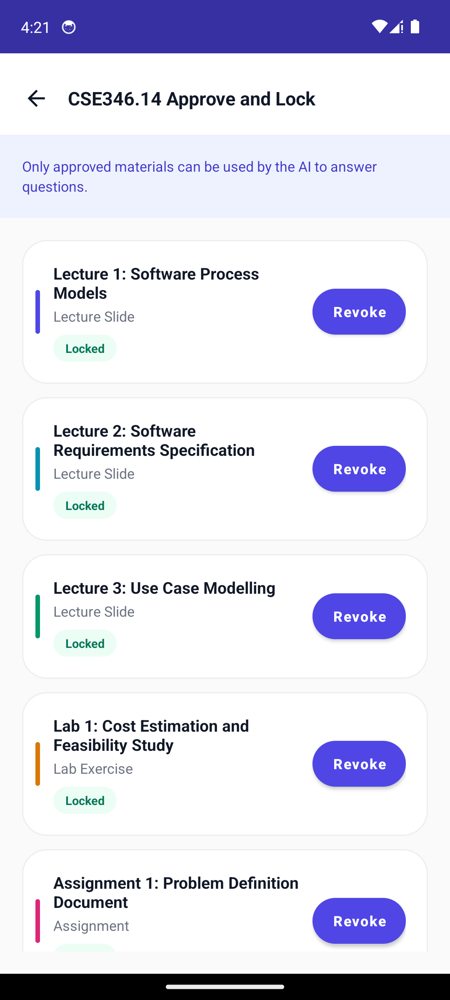
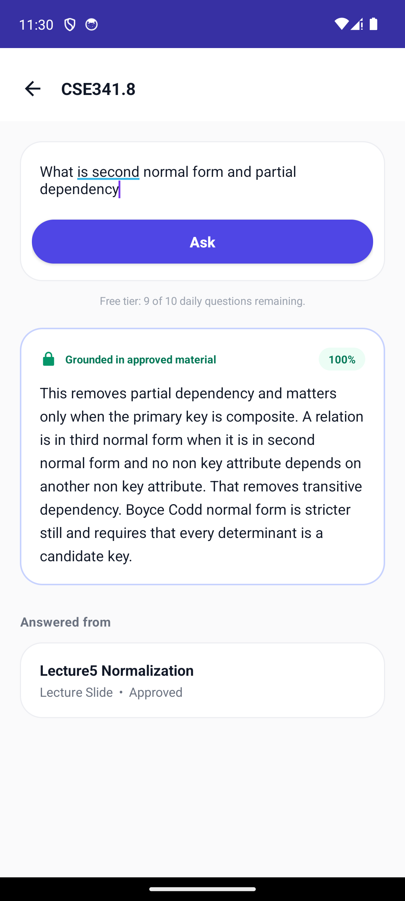
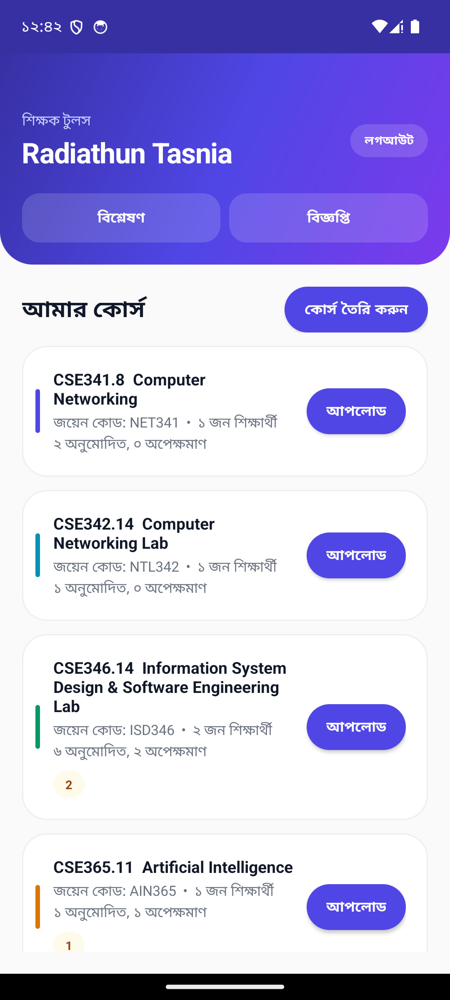

# Course-Grounded Study Assistant

An Android study assistant that answers students' questions **only from teacher-approved course material**. If the approved material doesn't cover a question, the app declines instead of guessing.

Built for **CSE 346 (Software Engineering)** as the native Android evolution (SRS §8) of the project defined in the Problem Definition Document, SRS and Cost Finding Report.


## Features

| Feature | Description |
|---|---|
| **Content Lock** | Answers come only from material the teacher has approved. If coverage is below the **34%** threshold, the app declines and says why. |
| **Source citations** | Every answer cites the approved material it was drawn from. |
| **Lecture Connection Finder** | Lists related lectures, assignments and quizzes from the same course alongside each answer. |
| **Teacher workflow** | Create courses, upload PDF material, approve or revoke it, share join codes, view analytics. |
| **Student workflow** | Join courses by code, ask questions, search, bookmark materials, track progress. |
| **Free and paid tiers** | Daily question counter for the free tier, with an upgrade and payment flow. |
| **Bilingual UI** | English and Bangla (বাংলা), with light and dark themes. |

## Screenshots

| Approve and lock | Answer from approved PDF | Bangla interface |
|---|---|---|
|  |  |  |

More screenshots are in [`Screenshots/`](Screenshots/). The Figma designs are in [`Figma_Screens/`](Figma_Screens/) as editable SVG files.

## How the Content Lock works

1. A teacher uploads material. It is text-extracted and chunked, and starts as **Pending**.
2. A student asks a question. The app retrieves matching chunks from **approved** material only.
3. If coverage is at least 34%, it answers and cites its sources. Otherwise it declines.
4. When the teacher approves the material, the same question gets an answer.

## Tech stack

- **Language:** Java, with XML layouts
- **UI:** Material Components, RecyclerView, bottom navigation
- **PDF parsing:** [PdfBox-Android](https://github.com/TomRoush/PdfBox-Android)
- **Networking:** OkHttp (OpenAI API for general answers)
- **Build:** Gradle (Kotlin DSL), Android Gradle Plugin 9, JDK 21
- **SDK:** minSdk 24, targetSdk 37

## Getting started

### Prerequisites
- Android Studio (recent version) with Android SDK 37
- JDK 21
- An Android device or emulator running Android 7.0 (API 24) or newer

### Build and run
1. Clone the repository:
   ```bash
   git clone https://github.com/Muktaditbf/Course-Grounded-Study-Assistant.git
   ```
2. In Android Studio, choose **File → Open** and select the **`StudyAssistant`** folder (not the repo root).
3. *(Optional)* To enable general AI answers, add your key to `StudyAssistant/local.properties`:
   ```properties
   OPENAI_API_KEY=your_key_here
   ```
   This file is git-ignored, so the key stays on your machine. Without a key, the app still works and shows a "key not set" message for AI-only features.
4. Wait for Gradle sync, then press **Run ▶**.

A prebuilt debug APK is included as [`StudyAssistant.apk`](StudyAssistant.apk) for quick installation.

### Demo accounts

| Role | Email | Password |
|---|---|---|
| Teacher | `teacher@seu.edu.bd` | `teacher123` |
| Student | `student@seu.edu.bd` | `student123` |

These are demo credentials only. The student is pre-enrolled in 7 sample courses, and the join code `ISD346` is available for the Join Course flow.

### Try the Content Lock
1. Log in as the **student**, open **CSE346.14**, tap **Ask a Question** and enter `What is equivalence partitioning?`. The app declines at 0% coverage.
2. Log out and log in as the **teacher**. Open **CSE346.14** and approve **Lecture 4: Software Testing Fundamentals**.
3. Log back in as the student and ask the same question. It now answers at 100% coverage and cites Lecture 4.

The full demo script is in [`HOW_TO_RUN.md`](HOW_TO_RUN.md).

## Project structure

```
.
├── StudyAssistant/            # Android Studio project
│   └── app/src/main/
│       ├── java/com/seu/studyassistant/
│       │   ├── adapter/       # RecyclerView adapters
│       │   ├── data/          # Local data and storage
│       │   ├── engine/        # Retrieval, coverage and OpenAI client
│       │   ├── model/         # Data models
│       │   └── ui/            # Activities
│       └── res/               # Layouts, strings (en, bn), themes
├── Figma_Screens/             # Exported UI designs (SVG)
├── Screenshots/               # App screenshots
├── HOW_TO_RUN.md              # Setup and demo walkthrough
├── REQUIREMENTS_TRACEABILITY.md  # SRS requirements mapped to code
└── StudyAssistant.apk         # Prebuilt debug APK
```

## Documentation

- [How to run and demo](HOW_TO_RUN.md)
- [Requirements traceability](REQUIREMENTS_TRACEABILITY.md): maps FR1–FR10, NFR11–NFR16 and UC1–UC10 to the code
- [Project guide (PDF)](Study_Assistant_Project_Guide.pdf)

## Notes

- Never commit `local.properties` or APKs built with a real API key.
- The app is a coursework project, and the demo accounts and payment flow are simulated.
